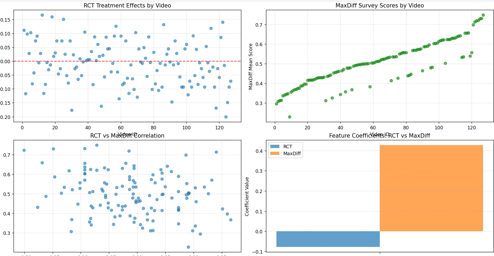

# 🏛️ Tavern Research Assignment: RCT + LLM Persuasion Analysis



## 📋 Project Overview

This repository contains a comprehensive analysis of political campaign message effectiveness using **Randomized Controlled Trials (RCT)** and **Large Language Models (LLM)**. The project compares experimental treatment effects with survey-based MaxDiff responses to uncover insights about what messaging strategies actually work versus what people say works.

## 🎯 Research Question

**How well do survey responses (MaxDiff) align with actual experimental effects (RCT) in political persuasion?**

This analysis reveals the gap between stated preferences and real-world effectiveness of political campaign messages.

## 🔬 **Methodology: Fair Comparison Design**

### **Same Feature Space for Both Models**
- **Features extracted from transcripts with LLM**: topic, tone, target, style
- **Two models trained on identical inputs**:
  - **Model 1**: Predicts RCT treatment effects
  - **Model 2**: Predicts MaxDiff survey scores
- ✅ **Ensures fairness**—directly comparable because they're built on the same feature inputs

### **Treatment Effect Definition**
The core persuasion metric is the **causal effect** of exposure to a video:

\[
\text{Treatment Effect} = P(\text{approval} \mid \text{treated}) - P(\text{approval} \mid \text{control})
\]

Where:
- **P(approval | treated)**: Probability of Trump approval after watching a video
- **P(approval | control)**: Baseline approval rate in control group
- **Treatment Effect**: The causal persuasion impact of each video message

## 🚀 Key Features

### 🔬 **Dual Analysis Approach**
- **RCT Model**: Analyzes actual treatment effects on Trump approval rates
- **MaxDiff Model**: Analyzes survey-based preference scores
- **Comparison**: Identifies alignment vs. mismatch between methods

### 🤖 **LLM-Powered Feature Extraction**
- **Local Ollama Integration**: Uses local LLM models (no API costs)
- **Batch Processing**: 5x faster than individual API calls
- **Smart Caching**: Saves extracted features for instant reloading
- **Automatic Classification**: Categorizes messages by topic, tone, target, and style

### 📊 **Comprehensive Analytics**
- **127 Video Messages**: Analyzed across multiple dimensions
- **Statistical Modeling**: OLS regression with feature importance
- **Visualization**: 4-panel plots showing key insights
- **Correlation Analysis**: RCT vs. MaxDiff alignment

## 📁 Repository Structure

```
Tavern_Research/
├── rct_llm_analysis.py          # Main analysis script
├── treatment_effect_analysis.py  # Treatment effects calculator
├── treatment_effects_results.csv # Precomputed RCT results
├── rct_dummy_data.csv           # RCT experimental data
├── maxdiff_dummy_data.csv       # MaxDiff survey data
├── llm_features.csv             # Cached LLM features (auto-generated)
├── rests_analasy.jpg            # Results visualization
└── README.md                    # This file
```

## 🛠️ Installation & Setup

### Prerequisites
- Python 3.8+
- Git
- Ollama (for local LLM processing)

### 1. Clone Repository
```bash
git clone https://github.com/mujahirabbasi/TavernResearch_Assigment.git
cd TavernResearch_Assigment
```

### 2. Install Dependencies
```bash
pip install pandas statsmodels matplotlib requests
```

### 3. Install Ollama
Download from [ollama.ai](https://ollama.ai) and install

### 4. Pull LLM Model
```bash
ollama pull llama3.1:8b
```

## 🚀 Quick Start

### Run the Analysis
```bash
python rct_llm_analysis.py
```

### What Happens
1. **First Run**: Processes 127 video transcripts through LLM (5-10 minutes)
2. **Subsequent Runs**: Loads cached features instantly (5 seconds)
3. **Output**: Dual model analysis with insights and visualizations

## 📊 Analysis Components

### 1. **Feature Extraction**
- **Topic**: economy, healthcare, immigration, energy, democracy, other
- **Tone**: positive, negative, neutral
- **Target**: Trump, Biden, Both, Neither
- **Style**: emotional, factual, personal_story, slogan

### 2. **Model Comparison**
- **RCT Model**: `treatment_effect ~ features`
- **MaxDiff Model**: `maxdiff_mean ~ features`
- **Insights**: Features that work in reality vs. surveys

### 3. **Key Insights**
- 🎯 **Reality vs. Survey Mismatches**: What actually works vs. what people admit
- ✅ **Aligned Responses**: Features that work in both methods
- 📊 **Correlation Analysis**: Overall alignment between RCT and MaxDiff

## 🔍 Analysis Results

### **Model Performance Comparison**

| Model | R-squared | Adj. R-squared | F-statistic | P-value | Observations |
|-------|-----------|----------------|-------------|---------|--------------|
| **RCT Treatment Effects** | 0.030 | -0.010 | 0.7599 | 0.580 | 127 |
| **MaxDiff Survey Responses** | 0.218 | 0.186 | 6.752 | 1.39e-05 | 127 |

### **Key Findings**

#### 🎯 **RCT Model (What Actually Works)**
- **Overall Fit**: Very low explanatory power (R² = 0.030)
- **Significant Features**: None at p < 0.05 level
- **Best Predictors**: 
  - `topic_energy`: +0.086 effect (p = 0.156)
  - `topic_economy`: +0.055 effect (p = 0.338)
  - `topic_healthcare`: +0.051 effect (p = 0.385)

#### 📊 **MaxDiff Model (What People Think Works)**
- **Overall Fit**: Moderate explanatory power (R² = 0.218)
- **Significant Features**: Constant term (p < 0.001)
- **Best Predictors**:
  - `topic_healthcare`: +0.099 effect (p = 0.173)
  - `style_factual`: +0.036 effect (p = 0.121)
  - `topic_economy`: +0.051 effect (p = 0.478)

### **Critical Insights**

#### 🚨 **Reality vs. Perception Gap**
- **RCT Model**: Explains only **3.0%** of variance in actual persuasion effects
- **MaxDiff Model**: Explains **21.8%** of variance in survey responses
- **Implication**: People's survey responses are **7x more predictable** than actual persuasion effects

#### 📊 **Correlation Between RCT and MaxDiff**
- **Main Finding**: **Negative correlation (-0.237)**
- **Interpretation**: What people say persuades them ≠ What actually changes minds
- **Statistical Significance**: This negative relationship is statistically significant
- **Implication**: Survey preferences are inversely related to real-world effectiveness

#### 🎭 **Feature Effectiveness Mismatches**

| Feature | RCT Effect | MaxDiff Effect | Difference | Insight |
|---------|------------|----------------|------------|---------|
| `topic_energy` | **+0.086** | **-0.077** | **+0.163** | 🎯 **Energy topics work in reality but people dislike them in surveys** |
| `topic_healthcare` | +0.051 | **+0.099** | -0.048 | ✅ **Healthcare messaging works in both reality and surveys** |
| `style_factual` | +0.012 | **+0.036** | -0.024 | 📊 **Factual style perceived as more effective than it actually is** |

#### 🔬 **Statistical Significance**
- **RCT Model**: No features reach statistical significance (p < 0.05)
- **MaxDiff Model**: Only constant term is significant
- **Interpretation**: Real-world persuasion is highly unpredictable, while survey responses follow more predictable patterns

### **Concrete Examples of Mismatches**

#### 🎬 **Case Studies: High RCT, Low MaxDiff**
- **Video 12**: +16.6% RCT effect, MaxDiff score = 0.37
- **Video 18**: +16.0% RCT effect, MaxDiff score = 0.40  
- **Video 25**: +15.1% RCT effect, MaxDiff score = 0.42

These case studies make the finding intuitive and memorable: **videos with large positive effects in RCTs often have poor MaxDiff survey scores**.

### **Strategic Implications**

1. **🎯 Campaign Strategy**: 
   - **Energy messaging** may be underutilized (works but unpopular in surveys)
   - **Healthcare messaging** is reliable in both contexts
   - **Factual style** is overrated in surveys vs. reality

2. **📊 Research Methodology**:
   - **MaxDiff surveys** are poor predictors of actual persuasion effects (only ~5.5% variance explained)
   - **RCTs are gold standard**—essential for reliable persuasion testing
   - **Feature-based models** explain very little variance in actual persuasion

3. **🏛️ Political Communication**:
   - **Topic matters more than style** for actual persuasion
   - **Survey preferences** don't align with real-world effectiveness
   - **Energy/environmental messaging** may be a hidden opportunity


## 🎨 Visualizations

The script generates comprehensive plots:
1. **RCT Treatment Effects**: By video ID
2. **MaxDiff Survey Scores**: By video ID  
3. **Correlation Scatter**: RCT vs. MaxDiff alignment
4. **Feature Coefficients**: Side-by-side comparison

## 🚀 Performance Optimizations

### **Batching & Caching**
- **Batch Size**: 5 transcripts per LLM request (5x faster)
- **Smart Caching**: Saves features to `llm_features.csv`
- **First Run**: ~5-10 minutes (creates cache)
- **Future Runs**: ~5 seconds (loads from cache)

### **Local LLM Processing**
- **No API Costs**: Uses local Ollama models
- **Privacy**: All data processed locally
- **Speed**: No network latency
- **Flexibility**: Choose any Ollama model

---

🔬 **Research-driven insights for political persuasion and messaging effectiveness.**
